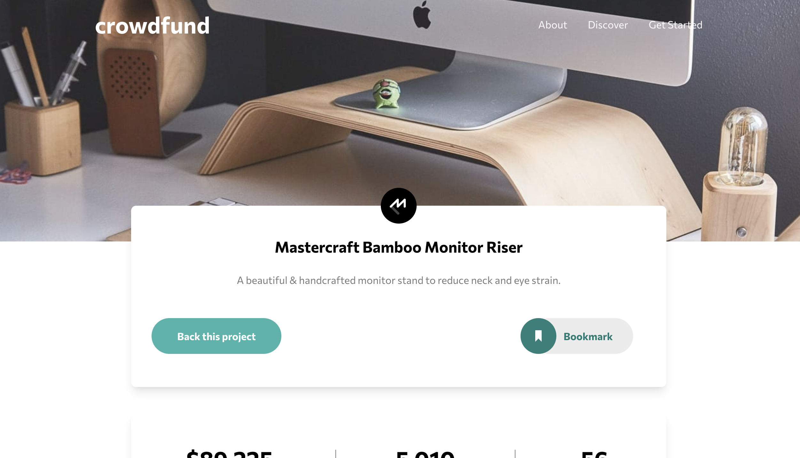
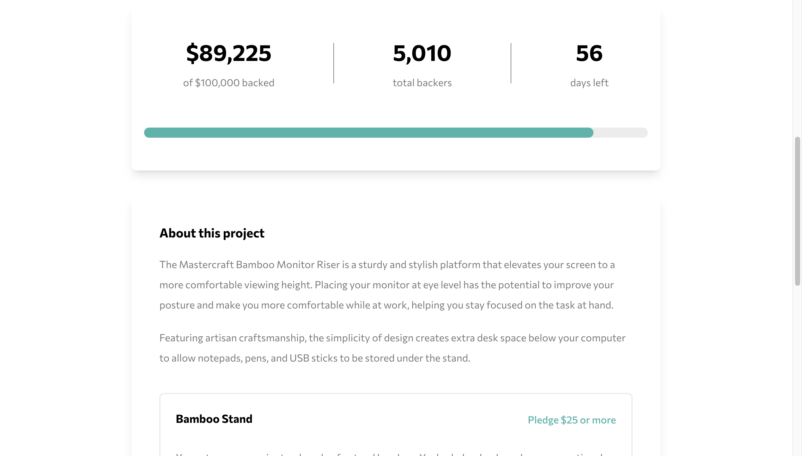
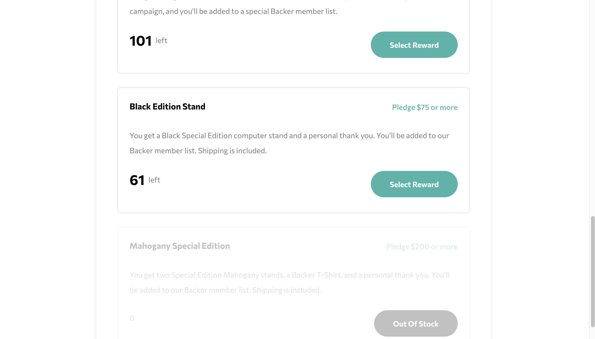

# Frontend Mentor - Crowdfunding product page solution

This is a solution to the [Crowdfunding product page challenge on Frontend Mentor](https://www.frontendmentor.io/challenges/crowdfunding-product-page-7uvcZe7ZR). Frontend Mentor challenges help you improve your coding skills by building realistic projects.

## Table of contents

- [Overview](#overview)
  - [The challenge](#the-challenge)
  - [Screenshot](#screenshot)
  - [Links](#links)
- [My process](#my-process)
  - [Built with](#built-with)
  - [What I learned](#what-i-learned)
  - [Continued development](#continued-development)

## Overview

### The challenge

Users should be able to:

- View the optimal layout depending on their device's screen size
- See hover states for interactive elements
- Make a selection of which pledge to make
- See an updated progress bar and total money raised based on their pledge total after confirming a pledge
- See the number of total backers increment by one after confirming a pledge
- Toggle whether or not the product is bookmarked

### Screenshot

### Links

- Solution URL: [SOLUTION SITE](https://www.frontendmentor.io/solutions/crowdfunding-product-page-reactjs-tailwind-css-4K1ru6pI0w)
- Live Site URL: [DEPLOYED SITE](https://crowdfunding-product-page-jjvega86.vercel.app/)

## My process

### Built with

- Semantic HTML5 markup
- Flexbox
- CSS Grid
- Mobile-first workflow
- [React](https://reactjs.org/) - JS library
- [Tailwind CSS](https://tailwindcss.com/) - For styles

### What I learned

The most difficult part of this was definitely managing state between modals and the main page when submitting pledges and changing the statistics for the project. Transitioning between the modals was also challenging, as well as organizing the components effectively. At one point, I had 3 different versions of both of my modals made because I initially call them inside of the button component that triggers them open.

I opted to use the Context API to handle the quantity state, and frankly, it was somewhat out of laziness because prop-drilling the values and functions to update them down would have been tedious. The only downside I could see to that approach is performance, but this is pretty lightweight as a website overall so I'm not worried about that aspect.

I'm most proud of the `PledgeSelection.jsx` component, especially utilizing the `useMemo` hook to compute states for when the quantity is at zero and therefore out of stock. This project really helped me understand the value of good state management and how easily React allows you to make this seamless.

### Continued development

I'd like to get into more intermediate/advanced React.js learning and refine my ability to manage state in complex component hierarchies. There's also room for growth with things like error handling and form validations, but I'm waiting to build my next project in Remix, which provides some great APIs for easily handling those states.

## Author

- Website - [JJ Vega](https://www.jjvega.pro/)
- Frontend Mentor - [@jjvega86](https://www.frontendmentor.io/profile/jjvega86)
- GitHub - [jjvega86](https://github.com/jjvega86)
